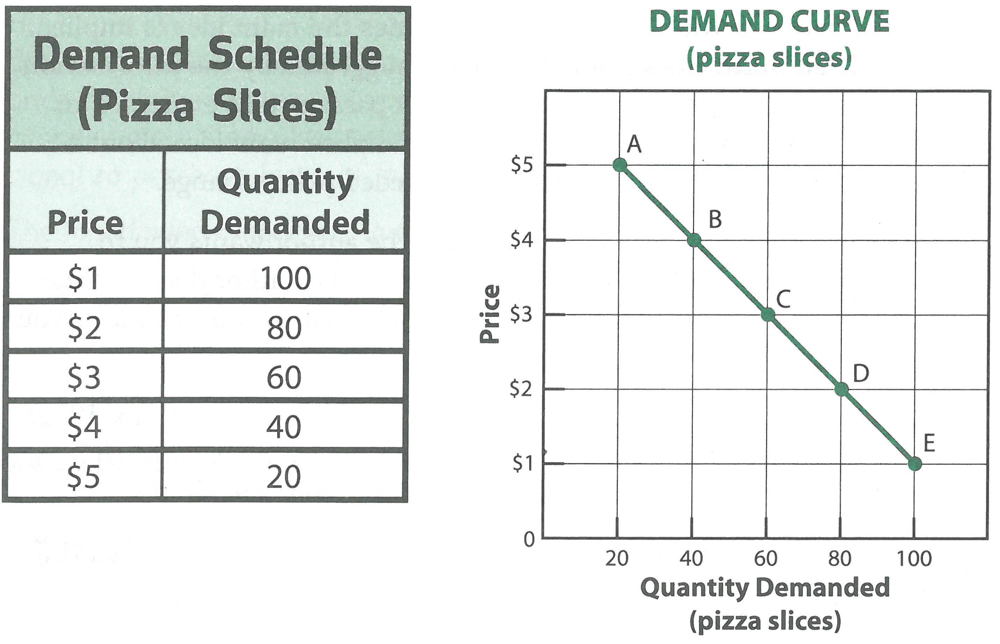
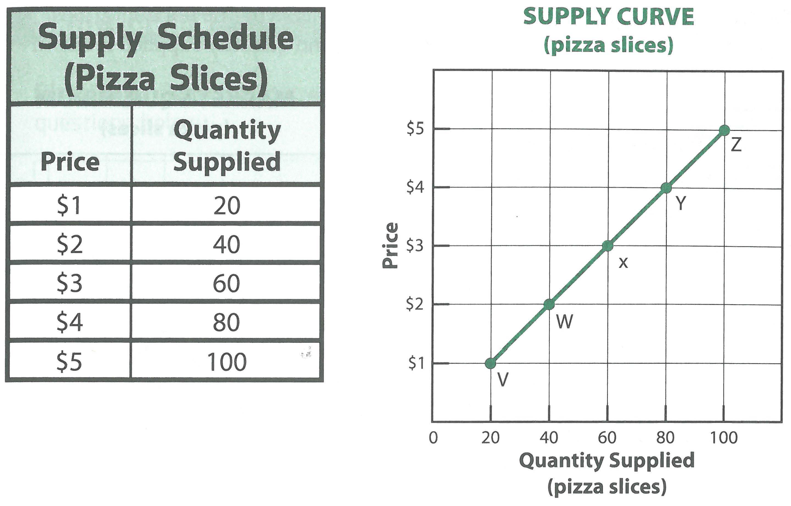
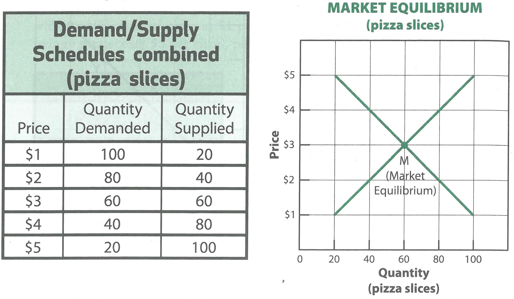

## Markets

A market is any situation in which a buyer and a seller freely choose to exchange one thing for another. Markets have two sides: a demand side (buyers or consumers) and a supply side (producers).

Markets have operated in different ways over time. Some ancient societies used barter as the method of exchange. Barter is the direct exchange of one product for another product. As civilizations grew, they often developed a form of money to make exchanges easier. Money is anything people will accept in payment for products. People have used precious metals, paper, shells, and stones as money.

Money helps set a price for products. When you shop, price helps you compare the value of products. For example, at a bakery the price of a donut may be $1, while the price of a Danish may be $2. This tells you that the value of the Danish is double the value of the donut. Where does the price of a product come from? To answer this question, we must examine the forces that create most prices in a market economy the forces of demand and supply.

### Demand and the Law of Demand

Demand is the amount of a product people are willing and able to buy at a specific price within a certain time. This definition may sound complicated but demand is really just common sense. The law of demand tells us that when the price of a product increases, the quantity we will buy falls. The reverse is also true. That is, when the price of a good decreases, the quantity we will buy goes up.

#### Demand Schedule and Demand Curve

Economists illustrate the law of demand in two ways: a demand schedule and a demand curve. A demand schedule is a table that shows how price impacts the quantity of a product that is demanded. The demand schedule for pizza slices is shown on page 192. As the price of a pizza slice increases, the quantity demanded falls.

A demand curve plots the numbers from the demand schedule onto a graph. The graph consists of two axes: the price axis (vertical) and the quantity-demanded axis (horizontal). The points show the number of slices people will buy at each price. For example, point E shows that people will buy 100 slices of pizza at $1 per slice. On the other hand, at point A (where pizza costs $5 per slice), people will only buy 20 slices.

{: .responsive-img .materialboxed }

The demand curve slopes downward to reflect the law of demand. The demand curve shows just one side of a market-the side of the consumer, or buyer. Looking at the demand curve, you can see that the lower the price, the more pizza consumers will buy. Producers, or suppliers, have a different perspective on how much of a product they should supply and at what price.

### Supply and the Law of Supply

Supply is the amount of a product businesses are willing and able to produce at a specific price in a certain time. When products are profitable, businesses are willing to produce more of them. The law of supply contrasts with the law of demand (which focuses on how much of a product a consumer is willing to buy). The law of supply says that when the price of a product increases, the supplier will increase production. Conversely, when the price decreases, the supplier will produce less.

#### Supply Schedule and Supply Curve

Economists illustrate the law of supply in two ways: a supply schedule and a supply curve. A supply schedule is a table that shows the impact of price on the quantity of a product supplied. The supply schedule shown on page 193 is for pizza slices. Note that as the price of pizza slices increases, the supplier is willing to increase the supply.

A supply curve plots the numbers from the supply schedule onto a graph. Price is on the vertical axis, and quantity supplied is on the horizontal axis. At point V, the producer will supply 20 pizza slices at $1 per slice. At point Z, in contrast, the producer is willing to supply 100 pizza slices because of the high price.

{: .responsive-img .materialboxed }

The supply curve slopes upward to reflect the law of supply. The supply curve shows just one side of a market-the side of the producer and seller of goods and services. The producer would like to produce a lot of pizza slices at the high price of $5 per slice. However, buyers would like to buy a lot of pizza slices at the low price of $1 per slice. To arrive at a fair compromise between these two opposing views, the demand curve and the supply curve must appear on the same graph.

### Market Equilibrium

The market equilibrium is the point where the demand is equal to the supply. It is the best compromise between the interests of the consumer and the interests of the producer.

To visualize market equilibrium, the demand curve and the supply curve must be placed on the same graph. What is the market equilibrium price and quantity for pizza slices? To answer this question, the data for both curves-the demand curve and the supply curve-are plotted on one graph, which is shown on page 194.

In the graph, price is on the vertical axis, and quantity is on the horizontal axis. This graph title indicates that quantity demanded and quantity supplied are both included in the graph.

{: .responsive-img .materialboxed }

The intersection (or crossing) of the demand curve and the supply curve shows the price and quantity at market equilibrium. This is at point M on the graph. The market equilibrium price is $3, and the market equilibrium quantity is 60 pizza slices. Keep in mind that demand and supply determine prices in a market economy.

### Government Intervention

The government sometimes steps in to set the price for goods or services. Price setting by the government is often called price control. There are two types of price controls: price floors and price ceilings. A price floor occurs when the government creates a minimum (lowest) price for a good, service, or resource. For example, the minimum wage is a price floor because it sets the minimum price (hourly wage) that an employer can pay workers. A price ceiling occurs when the government creates a maximum (highest) price for a product. For example, rent control on apartments is a price ceiling because it sets the maximum price (monthly rent payment) that the apartment owner can charge tenants.
