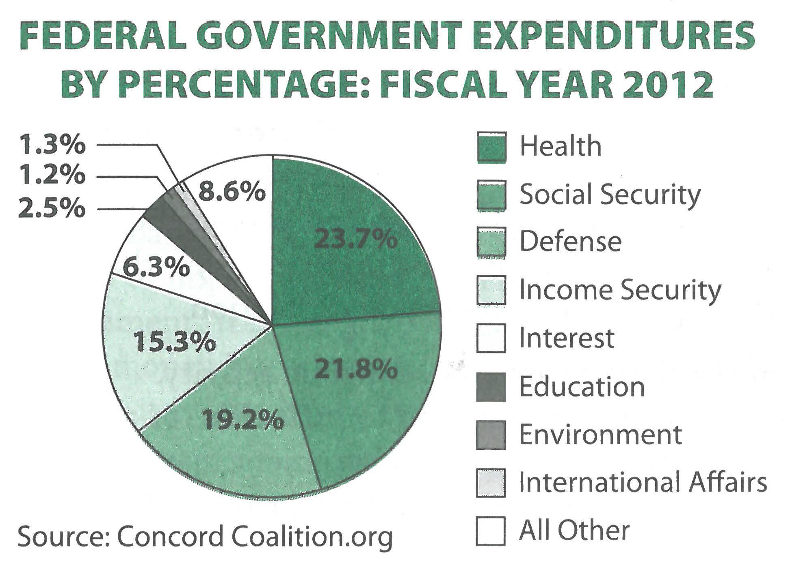
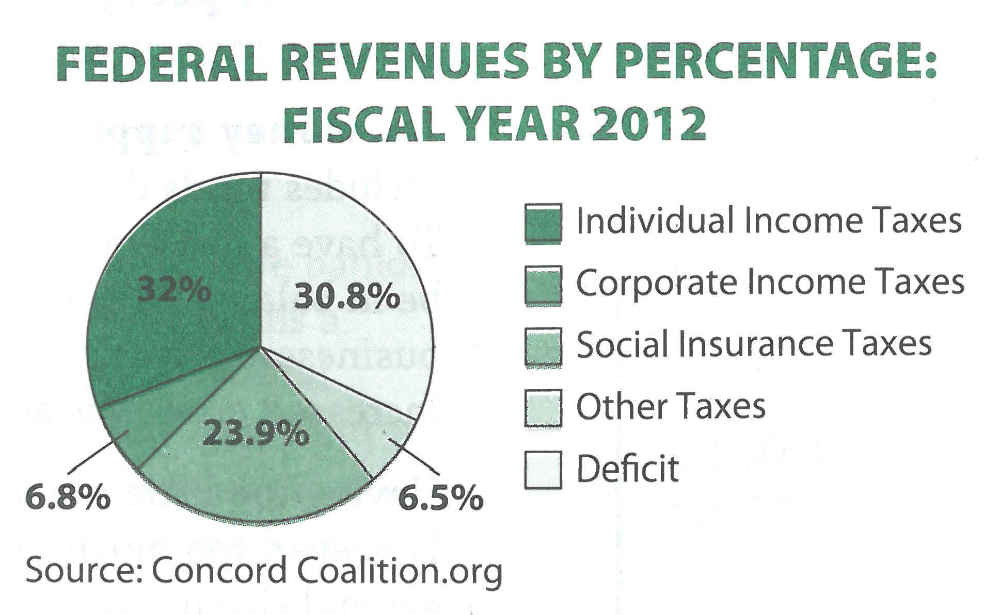

## Federal Revenue and Expenditures

The US government is a massive organization with millions of employees. To pay for itself, the government collects taxes. The government spends that money to do its business. The term fiscal policy refers to the government's taxing 'and spending policies. Congress and the president determine US fiscal policy.

The word fiscal comes from an old Latin word that means "basket." It refers to a basket that was used to hold money. Associating the word fiscal with a basket is a good way to understand fiscal policy. Like individuals and private businesses, the federal government has income and expenses: it earns money and it spends money. Think of money going into and coming out of the federal government's basket.

Government income, or revenue, is received mostly in the form of taxes. This is money going into the basket. Income taxes (paid by people and by businesses) make up almost half of the federal government's revenue. A similar amount is raised through payroll taxes-Social Security and Medicare taxes that are deducted from every employee's paycheck. Other taxes make up a much smaller percentage of federal income. Each year the federal government collects about $2.5 trillion; that is $2,500,000,000,000! The federal government also takes money out of that basket.

Government expenditures are the money that is paid out. The federal government spends money for a wide variety of reasons. It buys aircraft carriers and builds office buildings. It finances weather research and bridge repairs. In addition, it pays the salaries of nearly 5 million government employees (including members of the armed services).

## Fiscal Policies

Because the government collects and spends so much money, its fiscal policies have a great influence on the economy. These policies also affect the way people behave.

Federal tax policies not only raise the money that the government needs, they also attempt to change the way people and businesses spend money. Many economists (people who study the economy) believe businesses and individuals will spend more money if they pay less taxes. When people buy more goods and services, there is more economic activity and more jobs are created. This, in turn, increases the amount of taxes collected. Tax policy is also used to discourage behavior. For example, the federal government has increased the taxes on tobacco products as a means of discouraging smoking.

{: .responsive-img .materialboxed }

Federal spending policy is a powerful tool as well. By buying hundreds of billions of dollars' worth of goods and services from private businesses, the federal government helps the economy. Often the government increases its expenditures in bad economic times in order to increase economic activity. For example, the federal government may provide additional benefits to people who lose their jobs so these people can continue to spend money and keep the economy moving.

For many years, the federal government has spent billions of dollars more than it has taken in. To cover its costs, it has borrowed large sums of money. The money that the federal government owes is called the national debt. Interest payments on the national debt are a major expenditure. This is a subject of concern to some economists.

{: .responsive-img .materialboxed }

## Monetary Policy

Another tool the federal government uses to manage the economy is monetary policy. Monetary policy is the federal government's control of the money supply and interest rates.

The money supply is the total amount of money in the economy. It includes funds deposited in banks and money in circulation, or in use. To have a healthy economy, the amount of money in circulation must be in balance. When the economy grows-that is, when people and businesses are earning more money and spending more money-that increased economic activity requires more money in circulation.

Having too little money in circulation can slow economic activity. However, too much money in circulation can lead to inflation, or a general rise in prices. If the economy slows, the government may put more money into circulation. If the economy is suffering from inflation, the government may take money out of circulation.

Just as the federal government controls the money supply to manage the economy, it also adjusts interest rates for the same purpose. The interest rate is the payment that a lender charges when someone borrows money. Interest rates are calculated as a percentage. For example, if you borrow $100 at a 5 percent interest rate, you would have to pay back $105 after one year.

To manage the economy, the federal government sometimes varies interest rates. If the economy is weak, the government may lower interest rates. This makes it easier for individuals and businesses to get-l:o-c1ns to start or expand businesses and purchase goods. If the economy is growing too rapidly, the government may increase interest rates in order to slow economic activity and fight inflation.

## The Federal Reserve System

In the United States, monetary policy is the responsibility of the Federal Reserve System. "The Fed," which is the central bank of the United States, has more freedom to act independently than most other government agencies. It was created by Congress in 1913 to achieve a number of economic goals.

The Fed is a complex organization that includes 12 Federal Reserve banks, private banks, and government officials. This organization performs a variety of important tasks. It serves the banking needs of the federal government. It holds government funds, makes government loans, and places money into circulation. It also serves the banking needs of private banks-it is "the banks' bank" -and helps monitor these private banks.

Perhaps the most important role of the Federal Reserve is to help manage the US economy. The goal of the Fed is to encourage economic growth, control inflation, and promote employment.

The Federal Reserve System is administered by its board of governors. Members of the board are appointed by the president, with the consent of the Senate. This board then works on its own to make decisions about monetary policy.

By influencing interest rates and the money supply, the Fed's actions can have a major impact on the US economy. Because the economy of the United States is so large, the Fed can even affect the world's economy. The Federal Reserve System is an enormously powerful organization.